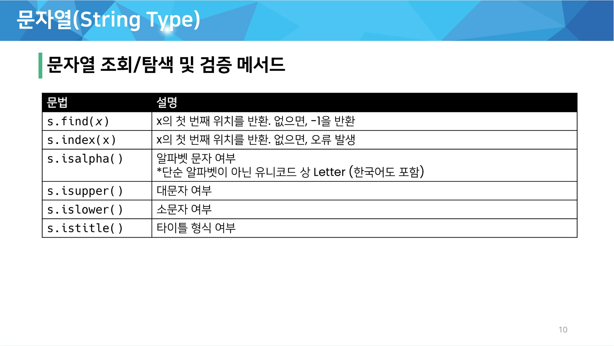
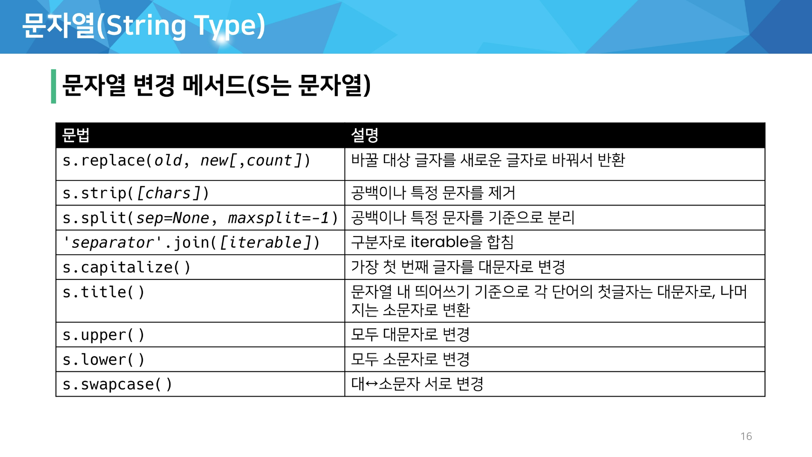
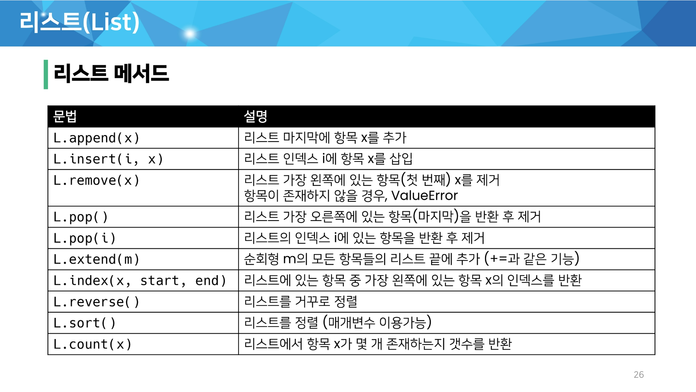
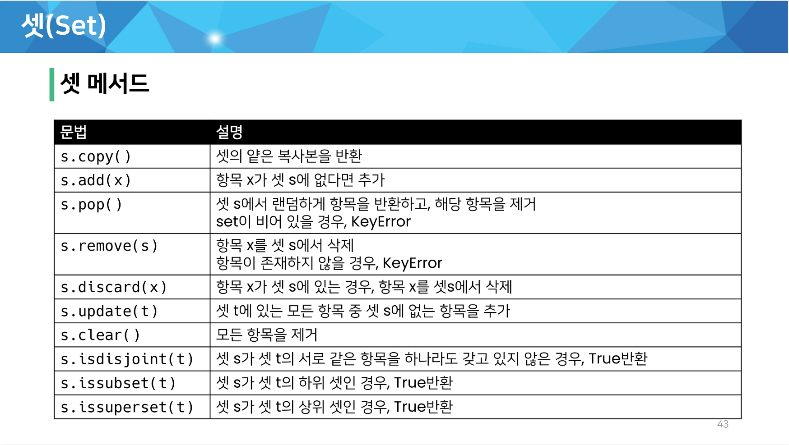
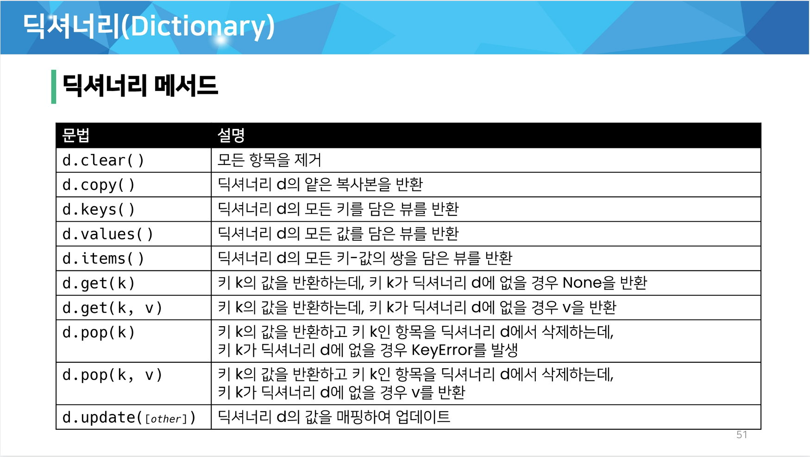

# 데이터 구조

<br>

## 데이터 구조 활용

* 메서드(method)
  * 클래스 내부에 정의한 함수, 사실상 함수 동일
  * 객체의 기능

**데이터 구조.메서드() 형태**

<br>



<br>
---
<br>
>문자열은 immutable인데, 문자열 변경이 되는 이유는?

* 기존의 문자열을 변경하는게 아니라, 변경된 문자열을 새롭게 만들어 반환



<br>
---
<br>



<br>
---
<br>



<br>
---
<br>



<br>

> 문자열 관련 검증 메서드

* isdecimal() 숫자 (가장 엄격)
* isdigit() 수
* isnumeric


---


* str.split(sep[,maxsplit])
  * sep = 구분자 default는 공백
  * maxsplit 는 분리할 단어의 갯수

>\>>> string = "a b c d"
>
>\>>> print string.split()
>
>['a', 'b', 'c', 'd']
>
>\>>> string = "a,b,c,d"
>
>\>>> print string.split()
>
>['a,b,c,d']
>
>\>>> print string.split(',')
>
>['a', 'b', 'c', 'd']
>
>\>>> print string.split(',', 1)
>
>['a', 'b,c,d']
>
>\>>> print string.split(',', 2)
>
>['a', 'b', 'c,d']
>
>\>>> print string.split(',', 3)
>
>['a', 'b', 'c', 'd']


> 튜플 관련 메서드

* 튜플은 immutable이기 때뭉네 값에 영향을 미치지 않는 메서드만을 지원
* 리스트 메서드 중 항목을 변경하는 메서드들을 제외하고 대부분 동일


> 딕셔너리

* .get(key[,default])
  * key를 통해 value를 가져옴
  * **KeyError가 발생하지 않으며**, default 값을 설정할 수 있음(기본: None)
* .pop(key[,default])
  * key가 딕셔너리에 있으면 제거하고 해당 값을 반환
  * 그렇지 않으면 default를 반환
  * **default값이 없으면 KeyError**


## 얕은 복사와 깊은 복사

> 할당(assignment)

* 대입 연산자(=)
  * 대입 연산자(=)를 통한 복사는 해당 객체에 대한 객체 참조를 복사
  * 해당 주소의 일부 값을 변경하는 경우 이를 참조하는 모든 변수에 영향

> 얕은 복사(shallow copy)

* Slice 연산자(a[:]) 활용하여 같은 원소를 가진 리스트지만 연산된 결과를 복사 (다른 주소)

* 얕은 복사 주의
  * b = a[:] 는 1차원 리스트만 복사
  * 리스트 안에 리스트는 리스트 원소가 안에 리스트의 주소를 복사하기 때문에
  * 이 때는 

> 깊은 복사 (deep copy)

```py
import copy

b = copy.deepcopy(a)
```


